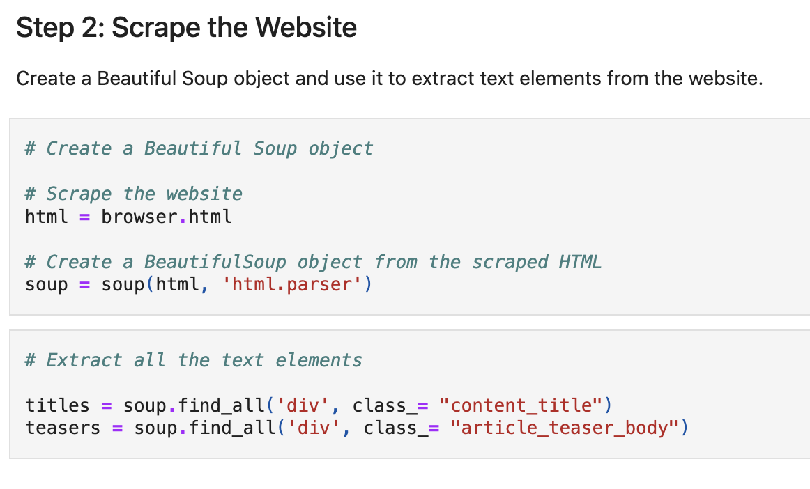

# module11-challenge
Mars News and Weather: Web Scraping and Data Analysis

## Contents
1. [Overview](#1-overview)
2. [Repository](#2-repository)
3. [Deployment](#3-deployment)
4. [Data Analysis and Notebook Workflow](#4-data-analysis-and-notebook-workflow)
    - [Part 1: Mars News Data](#part-1-mars-news-data)
    - [Part 2: Mars Weather Data](#part-2-mars-weather-data)
5. [Data Source](#5-data-source)
6. [Resources](#6-resources)

## 1. Overview
This challenge involves scraping and analysing data related to Mars using web scraping techniques. Part 1 focuses on scraping news articles from NASA's Mars News website to extract titles and previews of the latest articles. Part 2 involves scraping and analysing weather data from the Mars Temperature Data Site, which includes insights about temperature and atmospheric pressure. The results are designed to be insightful and visually accessible.

## 2. Repository
The repository contains the following:

- **Jupyter Notebooks**:
    - [`part_1_mars_news.ipynb`](part_1_mars_news.ipynb): Scrapes titles and preview text from Mars news articles.
    - [`part_2_mars_weather.ipynb`](part_2_mars_weather.ipynb): Scrapes and analyses Mars weather data.

- **Export Files**:
    - `export/dict_list.json` (part 1): Contains scraped Mars news articles in JSON format.
    - `export/mars_temp_df.csv` (part 2): Contains processed Mars weather data in CSV format.

## 3. Deployment
To deploy and run the analysis:

1. Clone the repository to your local machine.
2. Install the required Python libraries: `Splinter`, `BeautifulSoup`, `Pandas`, `Matplotlib`, and `JSON`.
3. Open the Jupyter notebooks (`part_1_mars_news.ipynb` and `part_2_mars_weather.ipynb`) in Jupyter Notebook.
4. Execute the notebooks step-by-step to scrape and analyse data.

## 4. Data Analysis and Notebook Workflow

### Part 1: Mars News Data
1. **Visit the Website**: 
    - Automated browsing is used to visit the [Mars News website](https://mars.nasa.gov/). 
    - The page is inspected to identify elements for scraping.
2. **Scrape the Website**: 
    - A BeautifulSoup object extracts text elements such as titles and previews of news articles.
3. **Store the Results**:
    - Titles and previews are stored in Python dictionaries, with each dictionary containing `title` and `preview` keys.
    - All dictionaries are stored in a Python list.
    - The list is converted into a Pandas DataFrame for further analysis and structured as follows:
        - `id`: Identification number for news articles.
        - `title`: Title of the news article.
        - `preview`: Summary of the news article.
    - Data is cleaned and converted to appropriate data types for analysis.

### Part 2: Mars Weather Data
1. **Visit the Website**:
    - Automated browsing is used to visit the [Mars Temperature Data Site](https://static.bc-edx.com/data/web/mars_facts/temperature.html). 
    - The HTML table on the page is identified for scraping.
2. **Scrape the Table**:
    - A BeautifulSoup object extracts the data from the table, which is converted into a Pandas DataFrame with the following columns:
        - `id`: Transmission identification number.
        - `terrestrial_date`: Earth date.
        - `sol`: Martian days since Curiosity landed.
        - `ls`: Solar longitude.
        - `month`: Martian month.
        - `min_temp`: Minimum temperature on a Martian day.
        - `pressure`: Atmospheric pressure at Curiosity’s location.
    - Columns are cleaned and converted to appropriate data types (e.g., `datetime`, `int`, `float`).
3. **Analyse the Data**:
    - Key questions are answered using Pandas functions and Matplotlib visualisations:
        1. **How many months exist on Mars?**
        2. **How many Martian (and not Earth) days are in the dataset?**
        3. **What are the coldest and warmest months on Mars?**
            - Calculate the average minimum daily temperature for all months.
            - Plot the results as a bar chart.
        4. **Which months have the lowest and highest atmospheric pressure on Mars?**
            - Calculate the average daily atmospheric pressure for all months.
            - Plot the results as a bar chart.
        5. **How many terrestrial (Earth) days exist in a Martian year?**
            - Estimate based on the time Mars circles the Sun by plotting the daily minimum temperature.

## 5. Data Source
1. **Mars News**: Titles and previews were scraped from the [Mars News Data Site](https://static.bc-edx.com/data/web/mars_news/index.html).
2. **Mars Weather**: Temperature and pressure data were scraped from the [Mars Temperature Data Site](https://static.bc-edx.com/data/web/mars_facts/temperature.html).

## 6. Resources
- The [Mars News Data Site](https://static.bc-edx.com/data/web/mars_news/index.html) is operated by edX Boot Camps LLC for educational purposes. Titles, previews, and data were scraped from [NASA's Mars News](https://mars.nasa.gov/) in November 2022.
- Images are used per the [JPL Image Use Policy](https://www.jpl.nasa.gov/jpl-image-use-policy), courtesy of NASA/JPL-Caltech.
